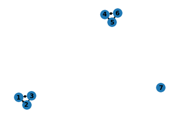

# hawksoft.relation package


hawksoft.relation包提供了一个Relation类，是对sympy的补充。该类可以生成一个二元关系对象，实现关系的表示，包括集合，图和矩阵；实现关系的运算，包括逆关系，关系的幂，关系的自反闭包，关系的对称闭包，关系的传递闭包。同时，由于关系本来就是集合，因此也支持集合的所有运算，包括交，并和补以及子集等。

## 安装

命令：
```
 pip install hawksoft.relation
 
```
 或者：
```
 pip install hawksoft.relation -i https://pypi.tuna.tsinghua.edu.cn/simple
 
```

该包需要sympy和networkx两个包,如果系统没有，则会自动安装。

## 使用

记住： 关系是定义在集合A（称为论域discourse）上的序偶的集合。

使用过程如下：
### 1 导入包
```
   from hawksoft.relation import Relation
```
### 2 定义论域集合A：
```
   Relation.setA(1,2,3) # 该集合可以以任何对象作为元素。
```
### 3 创建关系对象：
```
   r1 = Relation((1,2),(1,3))
   r2 = Relation.getUniversal() #生成一个全关系，即$A\timesA$
   r3 = Realtion.getIdendity()  #生成一个恒等关系
```
### 4 关系的表示
```
    r1.showSet()   # 将关系显示为集合
    r1.showMatrix()# 将关系显示为矩阵
    r1.showGraph() # 将关系显示为图
```

### 5 关系运算
```
    r5 = r2 - r1   # 关系的差
    r6 = r1 + r3   # 关系的并
    r7 = r1 ** -1  # 关系的逆关系
    r8 = r1 ** 2   # 关系的2次幂，即关系的复合。
    r9 = r1 ** 3   # 关系的3次幂 
    r10 = r1.reflectiveClosure() # 关系的自反闭包
    r10 = r1.symmetricClosure()  # 关系的对称闭包
    r10 = r1.transitiveClosure() # 关系的传递闭包
    
```

## 举例

### 例1:给定关系R，将R转化为一个最小的等价关系。


```python
from hawksoft.relation import Relation
Relation.setA(1,2,3,4,5,6,7)
r1 = Relation((1,2),(2,3),(4,5),(5,6))
r2 = r1.reflectiveClosure().symmetricClosure().transitiveClosure()
r2.showSet()
r2.showGraph()
```

    {(1, 1), (1, 2), (1, 3), (2, 1), (2, 2), (2, 3), (3, 1), (3, 2), (3, 3), (4, 4
    ), (4, 5), (4, 6), (5, 4), (5, 5), (5, 6), (6, 4), (6, 5), (6, 6), (7, 7)}



   

### 例2: 判断一个关系是满足传递性

 根据定理：一个关系R是传递的，当且仅当R的2次幂是R的子集。


```python
from hawksoft.relation import Relation
Relation.setA(1,2,3,4,5,6,7)
r1 = Relation((1,2),(2,3),(4,5),(5,6))
r2 = r1 ** 2
if r1.contains(r2):
    print('it is transitive')
else:
    print('it is not transitive')
```

    it is not transitive


```python

```
